<p align="center">
  <picture>
    <source media="(prefers-color-scheme: dark)" srcset="docs/brand/flow-logo-full-dark.svg">
    
  </picture>
</p>

<p align="center">
  <a href="https://github.com/KirtiJha/flow/actions/workflows/ci.yml"></a>
  <a href="https://www.npmjs.com/package/@kirtijha1986/flow"></a>
  =18">
  
</p>

<p align="center"><b>Fresh-context Loop for Orchestrated Work</b> — disciplined, cost-governed agent workflows for Claude Code &amp; GitHub Copilot.</p>

---

Most spec-driven AI tools **generate and trust**: write a spec, fan out tasks, let the
agent implement. FLOW is built for the part that comes after the demo — **shipping
real changes you can stand behind.** It drives an AI coding agent through disciplined
phases that each run in a **fresh-context subagent** (so quality doesn't rot as the
context fills), **caps token spend per phase with a hard block**, and refuses to ship
work an **independent verifier** hasn't passed. Authored once, generated into Claude
Code and GitHub Copilot.

```bash
npm install -g @kirtijha1986/flow && flow --claude   # install into your project
```
Then in Claude Code: `/flow "add rate limiting to the public API"` — FLOW triages the
request, announces the path + a token estimate, and runs it pausing at gates.

## How it works

Six phases, proportional to the work (`quick` skips most of them). Heavy phases run in
isolated subagents; the main session only sees compact summaries. Verify is adversarial
and **hard-gates Ship**.

<p align="center">
  
</p>

## Install

To **use** FLOW in your own project — no clone, no toolchain. Install the package
**persistently** (globally or as a dev dependency), then run `flow`:

```bash
# Recommended: global install (stable, available in every project)
npm install -g @kirtijha1986/flow
flow --claude          # install into THIS project (default, local scope)
flow --global          # install into ~/.claude (all projects)
flow --copilot         # GitHub Copilot layout instead
flow --all             # both runtimes
flow --uninstall       # remove FLOW files + hooks (keeps .flow/ state)
```

Or pin it to a single project as a dev dependency:

```bash
npm install -D @kirtijha1986/flow
npx flow --claude
```

The installer scaffolds `.flow/` state, generates the runtime layout
(`.claude/skills/…` and/or `.github/…`), and wires the three governance hooks into
`.claude/settings.json` with absolute paths. Restart Claude Code afterward so it
loads the hooks.

- **Zero build.** The package ships **precompiled `dist/`**, so you need no `tsx`,
  no `tsc`, and no build step.
- **Idempotent.** Re-run any time to update — generated files are refreshed, your
  `.flow/` state is never clobbered, and hooks are de-duped (never doubled).
- **`--global` vs `--local`.** `--local` (the default) targets the current project;
  `--global` targets `~/.claude/` so the layout is available across all projects.
- **`--uninstall`** removes FLOW-managed files and hook entries while **preserving
  your `.flow/` state** (STATE / CONTEXT / BUDGET / metrics) entirely.

> **Why a persistent install (not bare `npx @kirtijha1986/flow`)?** The installer wires
> hooks and command invocations using absolute paths into the installed package. A
> one-shot `npx @kirtijha1986/flow` runs from npm's temporary `_npx` cache, which can be
> evicted later — breaking those paths. A global or dev-dependency install gives the
> package a stable home, so the wiring keeps working.

> **Users install the package; contributors clone.** The "First run" steps below are
> only for cloning the dev repo to **develop FLOW itself** (they build from
> `.flow-src/` with `tsx`). If you just want to *use* FLOW, the install above is all
> you need.

## First run

> This section is for **contributors** developing FLOW itself. To merely use FLOW in
> your project, see [Install](#install) above.

The runtime layouts and hook wiring are **not** committed (they are generated and
machine-local), so a fresh clone needs two setup steps before the slash commands and
governance gates work:

```bash
npm install                                   # tsx + typescript
npm run gen                                   # REQUIRED: generate .claude/ + .github/ layouts
cp hooks/settings.example.json .claude/settings.json   # wire the budget / commit / metrics hooks
```

- **`npm run gen` is mandatory.** Without it there is no `.claude/skills/` directory,
  so `/flow` and the phase commands do not exist. Re-run it after any edit to
  `.flow-src/`.
- **Copy the hooks** to activate the deterministic gates (budget block, atomic-commit
  enforcement, metrics). Restart Claude Code afterward so it loads `.claude/settings.json`.
- **Sanity check:** `npm run typecheck && npm test` should both pass, and
  `npm run gen -- --check` should report no drift.

> On Windows, model tiers in `flow.config.json` resolve to native Claude Code aliases
> (`haiku`/`sonnet`/`opus`); switch them to your LiteLLM `model_list` names when
> routing through the gateway.

## Why FLOW — and how it's different

The space is full of excellent **spec-driven** tools (GitHub Spec Kit, OpenSpec, Task
Master, BMAD, Kiro). They shine at turning an idea into a spec and a task list. FLOW
overlaps there, but its center of gravity is **governance and verification** — the
things that decide whether agent output is actually safe to ship:

|  | Spec&nbsp;Kit | OpenSpec | Task&nbsp;Master | BMAD | Kiro | **FLOW** |
|--|:--:|:--:|:--:|:--:|:--:|:--:|
| Spec / phase pipeline | ✅ | ✅ | tasks | ✅ | ✅ | ✅ |
| **Fresh-context subagent per phase** | — | — | — | partial | — | **✅** |
| **Per-phase token budget, hard-blocked** | — | — | — | — | — | **✅** |
| **Caps calibrated from real spend (p50/p95)** | — | — | — | — | — | **✅** |
| **Independent verifier + machine-enforced ship gate** | advisory | advisory | — | advisory | human | **✅** |
| Proportional paths (skip the ceremony) | — | light | — | — | quick-plan | **✅** |
| One source → native multi-runtime + hooks | many agents | many agents | many editors | several | own IDE | **✅** |

<sub>Comparison from each tool's public docs (≈2026-06); competitors evolve — corrections welcome.</sub>

**What's genuinely distinctive:**

- **Cost is an enforced primitive, not a dashboard.** Every phase checks spend against a
  cap and a deterministic hook **hard-blocks at the ceiling** (exit 2). None of the
  surveyed spec-driven tools do spend-based blocking — that usually lives in separate
  infra products.
- **Budgets are measured, not guessed.** `flow-metrics calibrate` tunes caps from your
  recorded p50/p95 spend.
- **Verification has teeth — and separation of powers.** An independent verifier subagent,
  write-restricted to `VERIFY.md` and unable to edit code or ship, must record `PASS` or
  `/flow-ship` is mechanically blocked; on FAIL it **auto-repairs within budget**. That's
  stronger than advisory QA personas (BMAD) or human-approval gates (Kiro).
- **Fresh context per phase fights context rot.** Each heavy phase runs in its own
  subagent window; the orchestrator stays lean. None of the surveyed tools isolate phases
  this way.
- **Proportional ceremony.** `quick` / `standard` / `full` — a one-line change skips the
  pipeline; a project routing policy can only *raise* rigor, never silently lower it.
- **One authored source, native to two runtimes.** Generated into Claude Code (Skills +
  subagents + **deterministic hooks**) and GitHub Copilot — not just "works with many
  agents," but emitting runtime-native governance.

**Honest caveats:**

- **Young and focused.** FLOW targets two runtimes and is early; Spec Kit / OpenSpec /
  Task Master have far larger ecosystems and 20–30+ agent integrations, BMAD a richer
  QA-role model, Kiro a more polished IDE.
- **Opinionated environment.** Tuned for **Claude Code → LiteLLM → Bedrock**; budget
  governance assumes you meter against that path (tiers map to LiteLLM names — swap to
  native aliases for plain Claude Code). Native Dynamic Workflows are deliberately out of
  scope ([rationale](docs/flow/DECISION-GUIDE.md)).
- **A real gate means real friction.** `quick`-path work isn't shippable through
  `/flow-ship` without first producing a `VERIFY.md` — intentional, but worth knowing.

> **Use FLOW if** you want disciplined, cost-bounded, verify-gated delivery on Claude
> Code / Copilot. **Reach for the others if** you want the broadest agent coverage, a
> dedicated IDE, or the biggest community today.

## Runtime model

FLOW is built for the **Claude Code → LiteLLM → Amazon Bedrock** path. It provides
its **own** orchestration and does **not** depend on Claude Code's native Dynamic
Workflows or Agent Teams — that path is unreliable through a translation proxy and
burns unbounded tokens. FLOW implements the **adversarial verification** pattern (one
agent refutes another) with ordinary subagents. Model tiers (`low`/`mid`/`high`) map
to **LiteLLM `model_list` names** at build time via `flow.config.json`; no
hard-coded Anthropic/Bedrock model IDs. See
[`docs/flow/DECISION-GUIDE.md`](docs/flow/DECISION-GUIDE.md) for the full rationale.

## Two runtimes (not a clean mirror)

| | Claude Code | GitHub Copilot |
|--|-------------|----------------|
| Commands | `.claude/skills/<n>/SKILL.md` (or `--legacy-commands`) | `.github/prompts/<n>.prompt.md` (IDE chat) |
| Agents | `.claude/agents/<n>.md` (native subagents) | `.github/agents/<n>.agent.md` (handoffs) |
| Context | referenced from `CLAUDE.md` | injected into `.github/copilot-instructions.md` |
| Hooks | deterministic (budget / commit / metrics) | advisory (via instructions) |
| Fidelity | **full** | **first-class in IDE chat; CLI degraded** |

> The Copilot **CLI** does not support custom prompt files / slash commands. CLI
> users get FLOW through the injected `copilot-instructions.md` (the one file the CLI
> reads). FLOW does not claim CLI parity.

## Architecture

Author every command and agent **once** in `.flow-src/`. A generator (`flow-gen`) plus
per-runtime adapters emit native layouts for each runtime; a small TypeScript cost layer
(`flow-budget` / `flow-metrics` / `flow-compress`) and deterministic hooks enforce the
governance. State lives in committed `.flow/` files.

<p align="center">
  
</p>

## Layout

```
.flow-src/            canonical source — edit here
  commands/           11 command bodies
  agents/             5 subagent definitions
  templates/          STATE / CONTEXT / BUDGET templates
scripts/              flow-core, flow-budget, flow-compress, flow-metrics, flow-gen
  adapters/           claude-code.ts, copilot.ts (per-runtime transforms)
hooks/                budget gate, atomic-commit, post-session metrics
docs/flow/            ONBOARDING, COMMANDS, DECISION-GUIDE
.flow/                live state + metrics (committed)
.claude/ .github/     GENERATED by flow-gen — do not edit
flow.config.json      tier→LiteLLM mapping, runtime toggles, banner
```

## Scripts

| Command | What |
|---------|------|
| `npm run gen` | Generate both runtimes (Skills layout). |
| `npm run gen:legacy` | Generate Claude `.claude/commands/` instead of Skills. |
| `npm run gen -- --check` | Report drift without writing (CI). |
| `npm run gen -- --only copilot` | Generate a single runtime. |
| `npm run budget -- show` / `check <phase>` | Inspect / enforce per-phase caps. |
| `npm run metrics -- summary` | Spend / rework summary from `.flow/metrics/`. |
| `npm run metrics -- calibrate` | Per-phase p50/p95 → suggested caps vs. current. |
| `npm run compress` | Compress tool output on stdin (preserves errors/summaries). |
| `npm run typecheck` / `npm test` | Type-check / run the test suite. |

## Documentation

- [Onboarding](docs/flow/ONBOARDING.md)
- [Commands & agents reference](docs/flow/COMMANDS.md)
- [Decision guide](docs/flow/DECISION-GUIDE.md)
- [Changelog](CHANGELOG.md)

## License

MIT — see [LICENSE](LICENSE).
